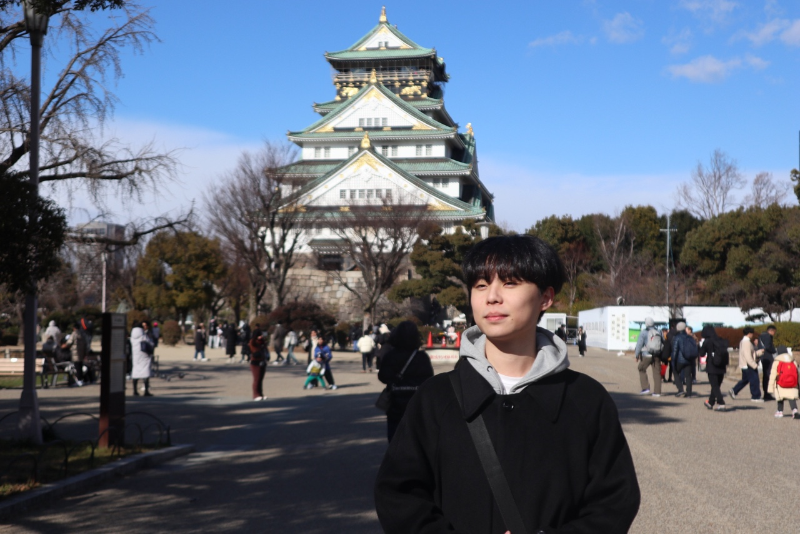

 

> Hello! I am a Konkuk University student who likes security and machine learning. I am deeply interested in the exploration of AI and cybersecurity and always want to learn something new. If you would like to collaborate or chat about ML & Security, please feel free to contact me.
>
> 안녕하세요! 저는 보안과 머신 러닝에 중점을 둔 건국대학교 학생입니다. AI와 사이버 보안에 대한 탐구에 깊은 관심을 가지고 있으며 항상 새로운 것을 배우고 싶어합니다. 만약 ML&Security에 대해 협업하거나 채팅하고 싶다면 편하게 연락 주시면 감사하겠습니다.

## **Education**

- Konkuk.university, Computer Science in 2024

## **Award**

- the 1st semester of 2024, **Dean’s List**

## **GPA**

- 1st semester of 2024, **1st place grades - 4.5/4.5**

## Connect with Me

Email: reopadbusiness@gmail.com
